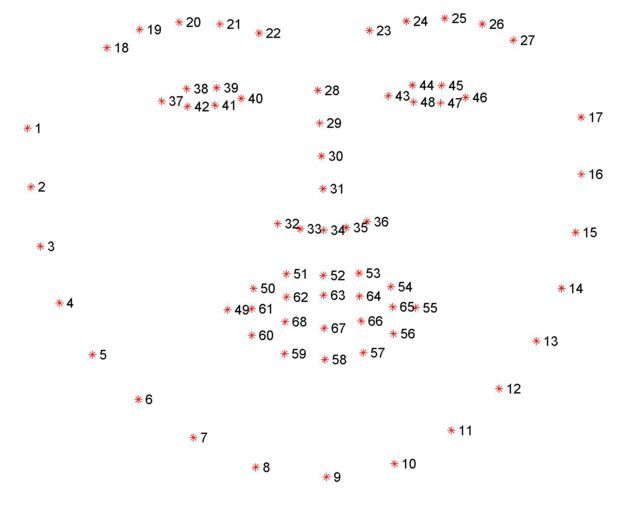

# 简介
VisioninSDK是一个实现移动端视频美颜、视频滤镜、人脸实时关键点追踪、人脸实时整形、人脸动态贴纸等功能的库。

VisioninSDK是一个跨平台的库，使用C++基于OpenGL ES 2.0实现，VisioninSDK提供了20多个自定义滤镜，VisioninSDK的滤镜结构类似GPUImage。

#### _注意：在运行demo时候，不要更改ios的bundlid和android的package_

# 商务合作：

* 手机号: 13911555671
* QQ 80017290

# iOS接入文档
## 1. 美颜|滤镜|换背景
保证包含SDK库文件

	#import "Visionin.h"

### 1.1 初始化

#### 添加全局初始化方法，比如在AppDelegate中：

`` [Visionin initialize:@"xxx"];`` 

- 其中xxx为应用的证书，应用证书的获取请联系 QQ 80017290

#### 首先，新建VSVideoFrame对象

``VSVideoFrame* videoFrame = [[VSVideoFrame alloc] initWithPosition:AVCaptureDevicePositionFront pixelFormat:kCVPixelFormatType_420YpCbCr8BiPlanarFullRange view:self.view];``

* Position：表示为前摄像头或者后摄像头，AVCaptureDevicePositionFront或者AVCaptureDevicePositionBack
* pixelFormat：输入视频帧格式，如果视频帧从摄像头来，则此处和摄像头的kCVPixelBufferPixelFormatTypeKey参数一致。目前支持格式类型：kCVPixelFormatType_420YpCbCr8BiPlanarFullRange、kCVPixelFormatType_32BGRA、kCVPixelFormatType_32RGBA，__注意：iphone摄像头没有kCVPixelFormatType_32RGBA，该格式用于从视频文件解析出的视频帧__
* view：处理后视频预览窗口

#### 然后调用startVideoFrame函数

`` [videoFrame startVideoFrame]; ``

#### 摄像头的captureOutput回调方法里获取到每一帧CMSampleBufferRef视频数据后，调用processVideoSampleBuffer处理视频帧

`` [videoFrame processVideoSampleBuffer:sampleBuffer]; ``

如果关闭摄像头，需要调用stopVideoFrame函数。

#### 注意：

* startVideoFrame与stopVideoFrame必须成对调用，否则会破坏状态机导致processVideoSampleBuffer函数不可用；

### 1.2 参数设置

#### 前后摄像头
前后摄像头切换时候，需要设置cameraPosition

#### 横竖屏
VisioninSDK默认为竖屏模式，屏幕旋转或者横屏等模式下，需要设置outputImageOrientation，支持以下屏幕方向参数：

* UIInterfaceOrientationMaskLandscapeRight
* UIInterfaceOrientationMaskLandscapeLeft
* UIInterfaceOrientationMaskPortrait
* UIInterfaceOrientationMaskPortraitUpsideDown

_注意：此处方向为StatusBar方向，非Device方向，获取StatusBar方向：_

``UIInterfaceOrientation orientation = [[UIApplication sharedApplication] statusBarOrientation]``

#### 镜像
VisioninSDK支持视频流、预览的镜像设置，可自由组合（不支持视频流镜像、预览非镜像的组合）：

* mirrorFrontFacingCamera: 前置摄像头下视频流是否镜像
* mirrorBackFacingCamera: 后置摄像头下视频流是否镜像
* mirrorFrontPreview: 前置摄像头下预览是否镜像
* mirrorBackPreview：后置摄像头下是否镜像

#### 自定义美颜程度
磨皮：

`` [videoFrame setSmoothLevel:level]; ``

* level的值介于0-1.0之间，为0时不磨皮，默认值0.5

美白：

`` [videoFrame setBrightenLevel:level]; ``

* level的值介于0-1.0之间，为0时不美白，默认值0.5

_如需关闭美颜，只要把所有参数设置为0即可_

### 1.3 获取经过美颜后的视频流
#### 获取不同格式视频流
VisioninSDk支持多种数据格式的获取，包括BGRA、YUV420P、NV21、NV12格式；

* BGRA支持CVPixelBufferRef数据，其余格式只支持获取byte类型
* 要获取某种类型数据输出，需要设置对应的Block变量
* 不同的数据获取互斥，只能同时获取一种格式

下面以获取BGRA格式的CVPixelBufferRef为例说明，并实现了一个封装为CMSampleBufferRef例子

	[videoFrame setBgraPixelBlock:^(CVPixelBufferRef pixelBuffer, CMTime time) {
        // 封装CMSampleBufferRef的例子
    	CVPixelBufferLockBaseAddress(pixelBuffer, 0);
    	CVPixelBufferRetain(pixelBuffer);		    
    	CMSampleBufferRef sampleBuffer = NULL;
    	CMSampleTimingInfo timimgInfo = kCMTimingInfoInvalid;
    	CMVideoFormatDescriptionRef videoInfo = NULL;
    	CMVideoFormatDescriptionCreateForImageBuffer(
                                                 NULL, pixelBuffer, &videoInfo);
    	CMSampleBufferCreateForImageBuffer(kCFAllocatorDefault,
                                       pixelBuffer,
                                       true,
                                       NULL,
                                       NULL,
                                       videoInfo,
                                       &timimgInfo,
                                       &sampleBuffer);
    	CVImageBufferRef cvimgRef = CMSampleBufferGetImageBuffer(sampleBuffer);
    	float _width = CVPixelBufferGetWidth(cvimgRef);
    	float _height = CVPixelBufferGetHeight(cvimgRef);
    	NSLog(@"width:%lf height:%lf", _width, _height);
    	
    	// 注意以下的释放代码
    	CFRelease(sampleBuffer);
	}];
	
#### 自定义视频流尺寸
一般情况下，本地预览使用较高分辨率，而编码使用较低分辨率，VisioninSDK支持自定义输出视频流尺寸，如下：

	[videoFrame setOutputSize:CGSizeMake(480, 640)];
### 1.4 滤镜
#### 使用滤镜
VisioninSDK提供了丰富的滤镜，如果要使用滤镜功能，则调用如下

	[videoFrame setExtraFilter:filterName];

#### 修改滤镜参数
如果要改动滤镜参数，如修改高斯模糊的半径，则调用如下：
	
	[videoFrame setExtraParameter:para];

#### 关闭滤镜
关闭滤镜
	
	[videoFrame closeExtraFilter];
		
#### 滤镜列表
目前支持的滤镜有：

* VS_GAUSSIAN_BLUR_FILTER	高斯模糊
* VS_MEDIAN_BLUR_FILTER		中值滤波，同样可实现模糊效果
* VS_FROSTED_BLUR_FILTER	类似毛玻璃的模糊效果
* VS_SATURATION_FILTER		饱和度
* 其他调色相关的滤镜：origin, nature, clean, vivid, fresh, sweety, rosy, lolita, sunset, grass, coral, pink,urban, crisp, valencia, beach, vintage, rococo, walden, brannan, inkwell

### 1.5 使用VisioninSDK提供的摄像头
VisioninSDK提供了一个简单的摄像头，可以不使用VSVideoFrame直接使用VSVideoCamera，VSVideoCamera支持所有VSVideoFrame的功能

#### 初始化

``VSVideoCamera* videoCamera = [[VSVideoCamera alloc] initWithSessionPreset:AVCaptureSessionPresetHigh position:AVCaptureDevicePositionFront view:self.view];``

* SessionPreset：分辨率，如AVCaptureSessionPresetHigh、AVCaptureSessionPreset1280x720或者AVCaptureSessionPreset640x480
* position：前摄像头或者后摄像头，AVCaptureDevicePositionFront或者AVCaptureDevicePositionBack
* view：视频预览窗口

#### 获取未处理的原始视频流
如果需要从VSVideoCamera获取没有经过美颜的视频流，需要实现VSCameraSampleDelegate协议

VSCameraSampleDelegate:

* willOutputAudioSampleBuffer: 未经处理的音频流
* willOutputVideoSampleBuffer: 未经处理的视频流

调用VSVideoCamera的setSampleDelegate方法

#### 开启摄像头：

`` [videoCamera startCameraCapture]; ``

## 2. 人脸关键点追踪

VisioninSDK支持国际通用的68个关键点的实时追踪，各个坐标序号如下所示：

### 2.1 开启
开启人脸关键点的追踪的功能只需要调用VSFacer函数的startFaceTracking

	VSFacer* facer = [VSFacer shareInstance];
	[facer startFaceTracking];
### 2.2 获取关键点
获取关键点使用VSFacer的getFacerMarks接口

`float* markers = [[VSFacer shareInstance] getFacerMarks];`

* 如果此时没有人脸，markers返回nil；
* 如果有人脸，则markers是一个68*2个元素的数组，markers[0]和marker[1]是第一个关键点的x坐标和y坐标，依次类推
* 返回的人脸坐标为像素坐标，不是归一化坐标

### 2.3 关闭关键点追踪
`[[VSFacer shareInstance] stopFaceTracking];`

如果不再使用该功能，请及时调用此接口关闭

___注意: 调用此接口可以停止整形功能，但是不能停止贴纸道具___
## 3. 使用人脸整形
### 3.1 启动
`[[VSFacer shareInstance] startShaper];`

整形依赖人脸关键点追踪，如果没有开启人脸情况启动整形，则会自动开启人脸追踪

目前的人脸整形包括大眼睛和瘦脸，未来会加入更多的整形功能

### 3.2 关闭整形
`[[VSFacer shareInstance] stopShaper];`

如果不再使用该功能，请及时调用此接口关闭

## 4. 互动道具贴纸

AR互动道具可以在人脸上叠加各种好玩的道具，包括2D和3D道具

### 4.1 设置道具
设置道具使用VSProps的startProps接口：

`[[VSProps shareInstance] startProps:name]`
### 4.2 停止使用道具
如果停止使用道具，则调用stopProps函数

`[[VSProps shareInstance] stopProps]`

___注意: 调用此接口不能停止人脸追踪和整形，要停止人脸追踪必须显示的调用stopFaceTracking接口___

# Android接入文档
## 1. 美颜|滤镜|换背景 
### 1.1 初始化

####调用全局初始化方法：

	Visionin.initialize(context, lisence);
	
注意：

* 第一个参数为Context类型，需要注意context的生命周期，如果context销毁可能引起VisioninSDK的错误，最好的方法是在Application中调用，或者使用getApplicationContext()
* lisence与IOS sdk的lisence使用同一个即可，注意在__开发者中心中设置android的包名__

#### 创建VSVideoFrame

VSVideoFrame是VisioninSDK所有功能的入口类，依赖Surface创建Opengl Context。

* 一般使用SurfaceView来提供Surface，并将处理后的数据绘制到SurfaceView上。
* 使用surfaceTexture()方法新建SurfaceTexture
* 设置Camera的PreviewTexture，然后开始摄像头的预览
*  __VSVideoFrame的创建一定要放在SurfaceHolder回调方法中__ ，不可以获取SurfaceView对象后直接用 ``surfaceView.getHolder().getSurface()``来创建。

典型的VSVideoFrame的创建如下：
	
	public void surfaceCreated(SurfaceHolder surfaceHolder) {
		try {
            videoFrame = new VSVideoFrame(surfaceHolder.getSurface());
            [videoFrame startVideoFrame];
        } catch (Exception e) {
            e.printStackTrace();
            return;
        }
        
        try {
            mCamera.setPreviewTexture(videoFrame.surfaceTexture());
            mCamera.startPreview();
        } catch (IOException e) {
            e.printStackTrace();
        }
    }

 
#### 调用start函数

`` videoFrame.start(); ``

#### 关闭摄像头

关闭摄像头，需要调用``stop``函数

_注意：start与stop必须成对调用，否则会破坏状态机导致SDK不可用_

#### 销毁
在程序进入后台时，需要销毁VSVideoFrame，在重新打开程序时候需要重新创建VSVideoFrame

销毁VSVideoFrame调用``videoFrame.destroy()``

### 1.2 参数设置

#### 前后摄像头
前后摄像头切换时候，需要调用``setCameraPosition``方法设置摄像头

* 前摄像头：VSVideoFrame.CAMERA_FACING_FRONT
* 后摄像头：VSVideoFrame.CAMERA_FACING_BACK

#### 横竖屏
VisioninSDK默认为竖屏模式，屏幕旋转或者横屏等模式下，需要调用``setOutputImageOritation``方法设置方向，支持以下屏幕方向参数：

* 竖屏：Configuration.ORIENTATION_PORTRAIT
* 横屏：Configuration.ORIENTATION_LANDSCAPE

#### 镜像
VisioninSDK支持视频流、预览的镜像设置，可自由组合（不支持视频流镜像、预览非镜像的组合）：

* ``setMirrorFrontVideo``方法: 前置摄像头下视频流是否镜像
* ``setMirrorBackVideo``: 后置摄像头下视频流是否镜像
* ``setMirrorFrontPreview``: 前置摄像头下预览是否镜像
* ``setMirrorBackPreview``：后置摄像头下是否镜像

#### 自定义美颜程度
磨皮：

`` videoFrame.setSmoothLevel(level); ``

* level的值介于0-1.0之间，为0时不磨皮，默认值0.5

美白：

`` videoFrame.setBrightenLevel(level); ``

* level的值介于0-1.0之间，为0时不美白，默认值0.5

_如需关闭美颜，只要把所有参数设置为0即可_

#### 关闭预览
如果您要自己压缩bitmap并预览，则可以把VisioninSDK提供的预览关闭，方法为：
	
	videoFrame.removeOutputView();
	
如果要再重新使用VisisioninSDK的预览，方法为：
	
	videoFrame.setOutputView();
	
###1.3 获取经过美颜后的视频流
#### 获取不同格式视频流
VisioninSDk支持多种数据格式的获取，包括RGBA、YUV420P、NV21、NV12格式；

* 要获取某种类型数据输出，需要设置对应的Callback参数
* 不同的数据获取互斥，只能同时获取一种格式

下面以获取NV21格式视频为例说明，并实现了一个封装为Bitmap例子

	videoFrame.setNV21Callback(new VSRawBytesCallback() {
		@Override
		public void outputBytes(byte[] bytes) {
			// width、height为输出视频尺寸，需提前设好
			int frameSize = width * height;
        	int[] rgba = new int[frameSize];
        	for (int i = 0; i < height; i++){
            	for (int j = 0; j < width; j++) {
                	int y = (0xff & ((int) data[i * width + j]));
                	int v = (0xff & ((int) data[frameSize + (i >> 1) * width + (j & ~1) + 0]));
                	int u = (0xff & ((int) data[frameSize + (i >> 1) * width + (j & ~1) + 1]));
                	y = y < 16 ? 16 : y;
                	int r = Math.round(1.164f * (y - 16) + 1.596f * (v - 128));
                	int g = Math.round(1.164f * (y - 16) - 0.813f * (v - 128) - 0.391f * (u - 128));
                	int b = Math.round(1.164f * (y - 16) + 2.018f * (u - 128));
                	r = r < 0 ? 0 : (r > 255 ? 255 : r);
                	g = g < 0 ? 0 : (g > 255 ? 255 : g);
                	b = b < 0 ? 0 : (b > 255 ? 255 : b);
                	rgba[i * width + j] = 0xff000000 + (r << 16) + (g << 8) + b;
            	}
            }
	        Bitmap bmp = Bitmap.createBitmap(width, height, Bitmap.Config.ARGB_8888);
        	bmp.setPixels(rgba, 0, width, 0, 0, width, height);
		}
	});
	
#### 自定义视频流尺寸
一般情况下，本地预览使用较高分辨率，而编码使用较低分辨率，VisioninSDK支持自定义输出视频流尺寸，如下：

	videoFrame.setOutputSize(360, 640);

### 1.4 滤镜
#### 使用滤镜
VisioninSDK提供了丰富的滤镜，如果要使用滤镜功能，则调用如下(以高斯模糊为例)

	videoFrame.setExtraFilter(VSVideoFrame.VS_GAUSSIAN_BLUR_FILTER);

#### 修改滤镜参数
如果要改动滤镜参数，如修改高斯模糊的半径，则调用如下：
	
	videoFrame.setExtraParameter(para);

#### 关闭滤镜
关闭滤镜
	
	videoFrame.closeExtraFilter()
	
#### 滤镜列表
支持的滤镜同ios

## 2. 人脸关键点追踪

VisioninSDK支持国际通用的68个关键点的实时追踪，坐标序号同iOS

### 2.1 开启
开启人脸关键点的追踪的功能，首先调用初始化函数，初始化函数只需要调用一次，然后调用VSFacer函数的startFaceTracking

	VSFacer.initialize(Context);
	VSFacer.startFacerTracking();
	
### 2.2 获取关键点
获取关键点使用VSFacer的getFacerMarks接口

`float[] markers = VSFacer.getFacerMarks(face_index);`

* 如果此时没有人脸，markers返回null；
* getFacerMarks的参数代表第几个人脸，0代表第一个人脸，依次类推，最多可支持8个人脸
* 如果有人脸，则markers是一个68*2个元素的数组，markers[0]和marker[1]是第一个关键点的x坐标和y坐标，依次类推
* 返回的人脸坐标为像素坐标，不是归一化坐标

### 2.3 关闭关键点追踪
`VSFacer.stopFaceTracking();`

如果不再使用该功能，请及时调用此接口关闭

___注意: 调用此接口可以停止整形功能，但是不能停止贴纸道具___
## 3. 使用人脸整形
### 3.1 启动
`VSFacer.startFacerShaper();`

整形依赖人脸关键点追踪，如果没有开启人脸情况启动整形，则会自动开启人脸追踪

目前的人脸整形包括大眼睛和瘦脸，未来会加入更多的整形功能

### 3.2 关闭整形
`VSFacer.stopFacerShaper();`

如果不再使用该功能，请及时调用此接口关闭

## 4. 互动道具贴纸

AR互动道具可以在人脸上叠加各种好玩的道具，包括2D和3D道具

### 4.1 设置道具
设置道具使用VSProps的startProps接口：

`VSProps.startStProps(name);`

name为道具名字

### 4.2 停止使用道具
如果停止使用道具，则调用stopProps函数

`VSProps.stopStProps();`

___注意: 调用此接口不能停止人脸追踪和整形，要停止人脸追踪必须显示的调用stopFaceTracking接口___

# 5. 变声和混音
#### 创建VSAudioFrame

VSAudioFrame是VisioninSDK音频功能的入口类，同VSVideoFrame类一样，需要先调用全局初始化方法,再创建VSAudioFrame对象：
	
	VSAudioFrame audioFrame = new VSAudioFrame();

####调用start函数

``audioFrame.start();``
	
####关闭音频

关闭音频与MIC，需要调用``stop``函数
注意：同VSVideoFrame一样，start与stop必须成对调用，否则会破坏状态机导致SDK不可用_
	
####声音特效功能

VisioninSDK提供了音频特效的功能，目前提供了改变声音音调的变音功能，具体调用如下：

	audioFrame.openSoundEffects();
	audioFrame.setMixerPitch(5);
	
``openSoundEffects``为开启音频特效的方法，与之对应的有关闭音频特效的``closeSoundEffects``方法。
``setMixerPitch``为设置音调高低的方法，参数区间在-12到+12之间，值越大音调越高。

####背景音混音功能

VisioninSDK提供了音频输入与背景音的混音功能，具体流程如下：
用``setMP3Accompany``方法选择并解码Mp3格式背景音文件，解码为耗时操作，如需在UI显示进度需要提前进行如下操作

*通过``setmHandler``设置接收进度消息的Handler
*通过``setProgressDialog``方法设置progressDialog和DecodeProgressListener
_注意:``setmHandler``方法需要在``setMP3Accompany``之前被调用；``setMP3Accompany``的两个String参数分别为背景音文件的路径和解码后的PCM格式文件的保存路径。_

背景音文件解码完毕后，可以调用``startAccompany``来开始播放背景音并做混音处理，并通过``stopAccompany``方法来关闭背景音与混音。

其他具体操作与参数设置详见Demo。

####设置是否在录音时播放

通过``setPlayWhileEncoding``设置是否在录音时播放录音。

####切换输出流编码格式

通过``setOutputFormat``设置输出流的编码格式，目前提供AAC和PCM两种编码格式。VSAudioFrame类中以静态变量的形式提供了可用的参数，切换AAC流的参数为VSAudioFrame.OUTPUT_FORMAT_AAC；
切换PCM流的参数为VSAudioFrame.OUTPUT_FORMAT_PCM。
_注意：设置应该在start方法前完成。_

####获取音频格式信息

通过``getSAMPLERATE``可以获取音频采样率
通过``getFORMAT_BIT``可以获取音频采样大小
通过``getCHANNELS``可以获取声道数

####获取输出的AAC格式音频流

通过调用``VSSoundBytesCallback``接口可以获取到转码后的AAC格式音频流。

以下是一段获取AAC流，并作为写入AAC文件的示例代码：

	    audioFrame.setSoundBytesCallback(new VSSoundBytesCallback() {
            @Override
            public void outputBytes(byte[] bytes) {
                if (bytes != null) {
                    try {
                        [your DataOutputStream].write(bytes, 0, bytes.length);
                    } catch (IOException e) {
                        e.printStackTrace();
                    }
                }
            }
        });
		
####获取输出的PCM格式音频流

同获取AAC格式音频流
参数可调节

